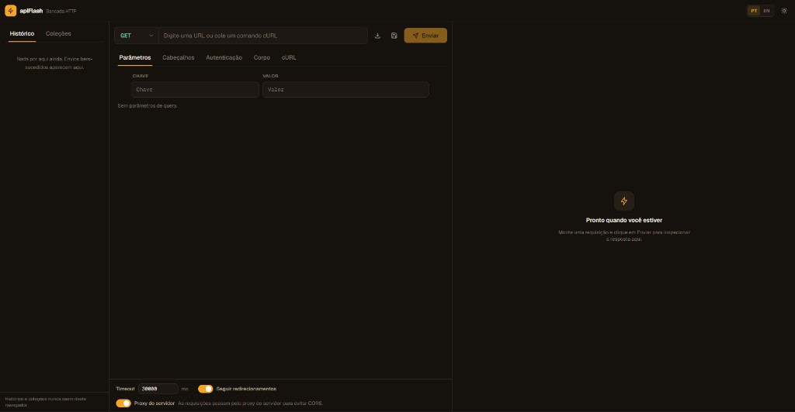

# apiFlash

A browser-based HTTP workbench for testing REST endpoints. It focuses on the fast loop you run every day: choose a method, enter a URL, add params, auth, headers and a body, send the request, and inspect the response.

apiFlash is a single TypeScript app — a React + Vite client with a small [Hono](https://hono.dev) server mounted in the same project. The server's only job is an optional request proxy to dodge browser CORS; everything else runs in the browser.



*Interface in Portuguese; switch to English anytime from the top bar.*

## Features

- Method selector for `GET`, `POST`, `PUT`, `PATCH`, `DELETE`, `HEAD` and `OPTIONS`.
- URL input with automatic `https://` normalization.
- Query parameter editor with enabled/disabled rows.
- Auth helpers for bearer token, basic auth and API key (header or query).
- Header editor with enabled/disabled rows.
- JSON, text and form URL-encoded body modes.
- JSON body validation, formatting and minifying.
- Timeout and redirect controls.
- Generated cURL preview for the current request.
- Auto-complete every field by pasting a cURL command (paste into the URL bar or use the import dialog).
- Server-side request proxy to reduce browser CORS friction.
- Response viewer with status, duration, size, body, headers and copy actions.
- Server-side history (full request + response + cURL) stored in MySQL.
- Persistent collections of saved requests in MySQL.
- Optional **anonymous mode**: disable “Save history” so successful requests are not written to the database.
- **Accounts** with name + password (JWT); history and collections are tied to your workspace.
- **Guest mode** without signup — ephemeral workspace per browser tab (`sessionStorage`).
- **Webhooks** — per-workspace inbox URLs (`/api/webhooks/inbox/:id`) that record incoming HTTP requests with headers, body, and client IP.
- Language toggle for Portuguese and English, plus a dark/light theme.

## Tech stack

| Layer | Choice |
| --- | --- |
| Client | React 18 + Vite + TypeScript + Tailwind CSS |
| State | Zustand |
| Server | Hono (proxy route), mounted via `@hono/vite-dev-server` in dev and `@hono/node-server` in production |
| Storage | MySQL for history and collections; `localStorage` for theme, language, auth token, and save-history preference; `sessionStorage` for guest workspace id |
| Auth | `bcryptjs` + `jose` (JWT HS256) on `/api/auth/*` |
| Tests | Vitest |

## Getting started

Requires Node.js 20+ and MySQL 8+ (or MariaDB with JSON support).

### Database setup

1. Create the database (example for WAMP/phpMyAdmin):

```sql
CREATE DATABASE apiflash CHARACTER SET utf8mb4 COLLATE utf8mb4_unicode_ci;
```

2. Copy `.env.example` to `.env` and set your MySQL credentials.

3. Run migrations:

```bash
npm install
npm run migrate
```

### Run the app

```bash
npm run dev
```

Then open the URL printed by Vite (defaults to http://localhost:5173). The `/api/*` routes are served by Hono inside the same dev server, so the proxy and MySQL APIs work without a second process.

## Scripts

| Script | Description |
| --- | --- |
| `npm run dev` | Start the Vite dev server (client + API). |
| `npm run build` | Type-check and build the client into `dist/`. |
| `npm run build:server` | Bundle the production Node server into `dist-server/`. |
| `npm run start` | Run the production server (serves `dist/` + the API). |
| `npm run preview` | Build everything and start the production server. |
| `npm run test` | Run the Vitest suite. |
| `npm run typecheck` | Type-check the whole project. |
| `npm run migrate` | Apply SQL migrations to MySQL. |

### Production

```bash
npm run build
npm run build:server
npm run start   # http://localhost:8787 (set PORT to change)
```

## The proxy and SSRF protection

When "Server proxy" is on, requests go through `POST /api/proxy`, which fetches the target server-side so the browser never hits CORS. Because that is effectively an open fetcher, the proxy validates every target and **blocks private, loopback and cloud-metadata addresses by default** (10.x, 127.x, 169.254.x, 172.16–31.x, 192.168.x, `::1`, link-local, etc.).

To test APIs on `localhost` or your LAN, either:

- turn the proxy **off** so the request is sent straight from the browser, or
- set `APIFLASH_ALLOW_PRIVATE=1` before starting the server to relax the guard.

```bash
# allow local/LAN targets through the proxy (use only when you trust the network)
APIFLASH_ALLOW_PRIVATE=1 npm run start
```

## Authentication and workspaces

History and collections require authentication:

- **Signed-in users** send `Authorization: Bearer <JWT>`. The server resolves the workspace from the token (the `X-ApiFlash-Workspace` header is ignored for logged-in users).
- **Guests** send `X-ApiFlash-Mode: guest` and a workspace UUID in `X-ApiFlash-Workspace` (stored in `sessionStorage`, one per tab). Data is isolated per tab and not tied to an account.
- **`/api/proxy`**, **`/api/health`**, and **`/api/webhooks/inbox/:id`** stay public so the workbench and webhook receivers work without an account.

Set a strong `JWT_SECRET` (32+ characters) in `.env` before deploying publicly. Passwords are hashed with bcrypt; tokens expire per `JWT_EXPIRES_IN` (default `7d`).

### Security notes for public deploys

- Do not use the default `JWT_SECRET` from `.env.example` in production.
- Guest workspaces are created on the server when first used; they are not password-protected — treat guest data as disposable.
- Turn off **Save history** to skip persisting successful requests even when signed in.
- History entries include full request and response payloads. Do not store production secrets on shared hosts.

Avoid saving production credentials in a public demo unless you control the environment. Anything you type into auth, headers or a body is sent to the target you choose (directly or via the proxy).

## Webhooks

Each workspace can create webhook inbox endpoints. External services POST (or use any HTTP method) to:

```
https://your-host/api/webhooks/inbox/{webhookId}
```

Receipts appear in the **Webhooks** sidebar tab (polled every few seconds while the tab is open). Optional validation: `X-Webhook-Secret` header or `?secret=` query param when a secret is configured on create/update.

For local testing with external providers, expose the dev server via your LAN IP or a tunnel (ngrok, Cloudflare Tunnel, localtunnel). The in-app network guide summarizes common setups.

Optional env vars: `APIFLASH_WEBHOOK_BODY_LIMIT` (bytes, default 2MB), `APIFLASH_WEBHOOK_RATE_LIMIT` (requests per minute per inbox, default 120).

## Project layout

```
src/
  core/            Shared, framework-free logic (also unit-tested)
    types.ts       Request/response models and factories
    url.ts         URL normalization and query helpers
    request.ts     Assemble a RequestSpec into a concrete request
    json.ts        JSON validate / format / minify
    curl/          cURL parse + build
  server.ts        Hono app (proxy + /api/auth + /api/history + /api/collections + /api/webhooks)
  server/auth/     JWT, password hashing, user repository
  server.node.ts   Production entry: serves dist/ + the API
  server/db/       MySQL pool, repositories
  server/          Proxy handler and SSRF guard
  client/          React app (components, stores, i18n, API client)
  migrations/      MySQL schema migrations
```
